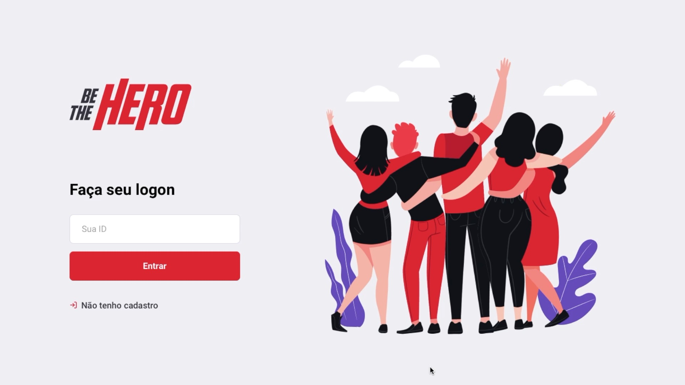
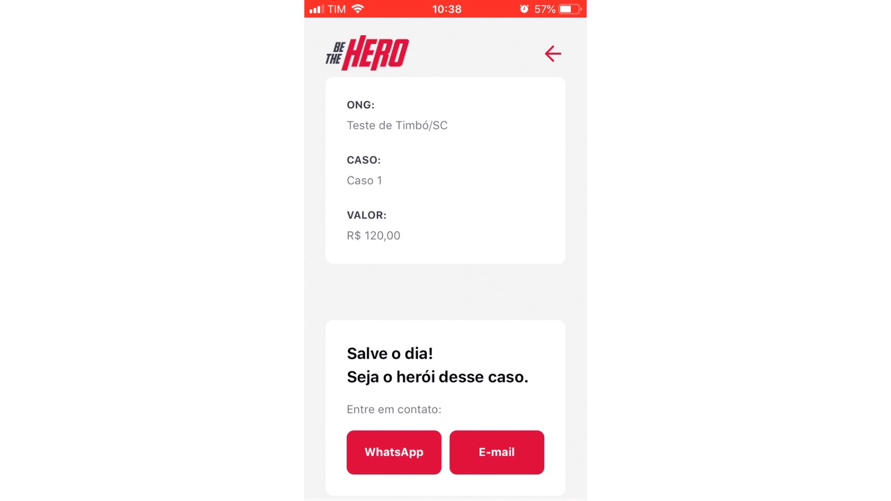

<h1>Be The Hero</h1>

- Projeto desenvolvido na Semana Omnistack da [Rocketseat](https://rocketseat.com.br)

- A ideia do projeto é:
    - Um portal web para cadastro de ONGs e seus casos específicos 
    - Um App para visualização das ONGs e seus casos, além de permitir ao voluntário ajudar financeiramente com um caso, enviando um e-mail ou WhatsApp

- Projeto desenvolvido em camadas
    - back-end (Acesso a base de dados, permitir consumir dados em JSON, permitir cadastro e remoção de registro)
    - front-end (Interface do usuário, para efetuar login, cadastrar-se, cadastrar casos e listá-los)
    - App (Listar Ongs, Exibir casos com paginação  em scroll infinito)

- Cada projeto (back-end, front-end e mobile) estão documentados em passo-a-passo de como foi desenvolvido.

---

<h2>Front-end</h2>

---

<h2>Mobile</h2>

